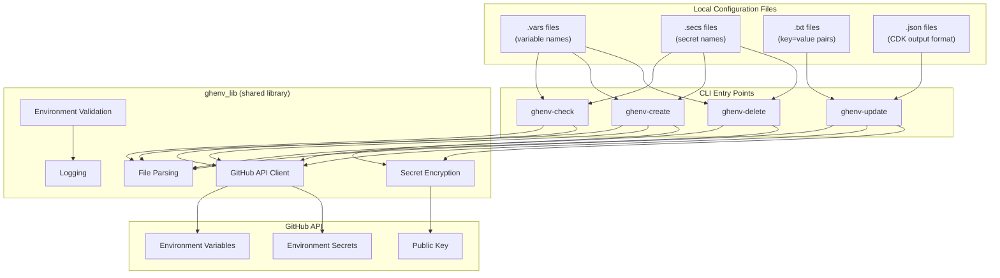
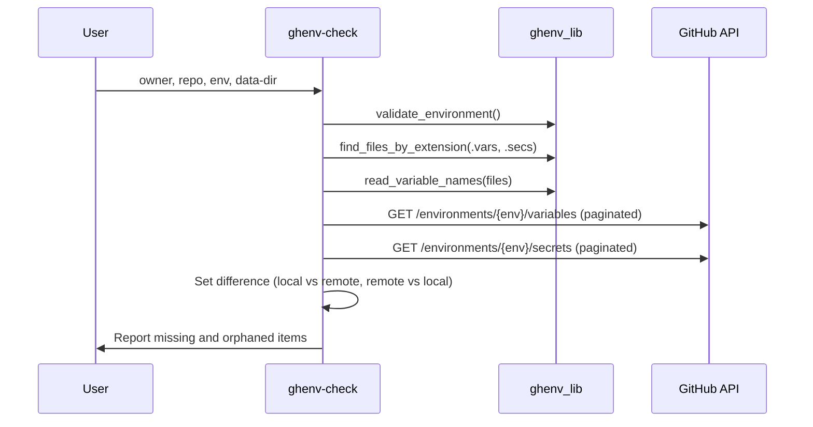

## Overview

ghenv is a Python CLI tool that synchronises GitHub environment variables and secrets with local configuration files. It provides four operations -- check, create, update, and delete -- each exposed as a standalone CLI entry point.

## System Architecture



## Project Structure

```
src/ghenv/
  __init__.py        -- package init, version = 0.0.2
  ghenv_lib.py       -- shared library (all core logic)
  check.py           -- bidirectional sync checker
  create.py          -- creates missing variables/secrets with placeholder "NONE"
  update.py          -- updates existing variables/secrets from value files
  delete.py          -- removes orphaned variables/secrets from GitHub
tests/
  test_ghenv_lib.py  -- unit and integration tests
  test_data/         -- fixture files for tests
```

## Technology Stack

| Component | Technology | Version | Rationale |
|---|---|---|---|
| Language | Python | >= 3.10 | Type hint support (union types with `\|`) |
| Build system | Hatchling | -- | Modern Python build backend |
| Package manager | uv | -- | Fast dependency resolution |
| HTTP client | requests | >= 2.32.4 | GitHub API communication |
| Encryption | PyNaCl (libsodium) | >= 1.6.0 | GitHub requires NaCl sealed-box encryption for secrets |
| Testing | pytest + pytest-mock + requests-mock | -- | Mocking HTTP and function calls |

## Data Flow

### Check Operation



### Create Operation

1. Validate environment (token + directory)
2. Find `.vars` and `.secs` files in data directory
3. Read and deduplicate names from files
4. Fetch existing variables/secrets from GitHub (avoid duplicates)
5. Fetch public key for secret encryption
6. Create missing variables via POST with value "NONE"
7. Create missing secrets via PUT with encrypted "NONE"

### Update Operation

1. Validate token and file path
2. Parse value file (`.txt` key=value pairs or `.json` CDK output)
3. Fetch existing variables and secrets from GitHub
4. For each name=value pair: update as variable (PATCH) or secret (PUT with encryption)
5. Skip items not found in GitHub

### Delete Operation

1. Validate environment (token + directory)
2. Find `.vars` and `.secs` files in data directory
3. Read local names, fetch remote names
4. Compute orphaned items (remote - local)
5. Delete orphaned items (or preview in dry-run mode)

## Key Design Patterns

- **Dual import pattern**: Each CLI script uses try/except ImportError to support both `from .ghenv_lib import ...` (module import) and `from ghenv_lib import ...` (direct execution)
- **Set-based comparison**: Check and delete operations use Python set operations for efficient diff computation between local and remote state
- **Pagination**: All list operations loop through pages of 100 items until an empty page is returned
- **Idempotent creation**: `create.py` pre-fetches existing items and skips already-present ones; `put_variable` handles 409 (conflict) gracefully
- **Sealed-box encryption**: Secrets are encrypted client-side using GitHub's environment public key before transmission, using NaCl anonymous encryption (SealedBox)

## Configuration

| Variable | Required | Default | Purpose |
|---|---|---|---|
| `GH_API_SECRET` | Yes | -- | GitHub token with `actions:write` permission |
| `LOG_LEVEL` | No | INFO | Logging verbosity (DEBUG, INFO, WARNING, ERROR) |

## Developer Onboarding

- Python >= 3.10 required
- Package manager: uv
- Install: `uv sync --all-extras`
- Run tests: `uv run pytest`
- Run CLI: `uv run ghenv-check <owner> <repo> <env> <dir>`
