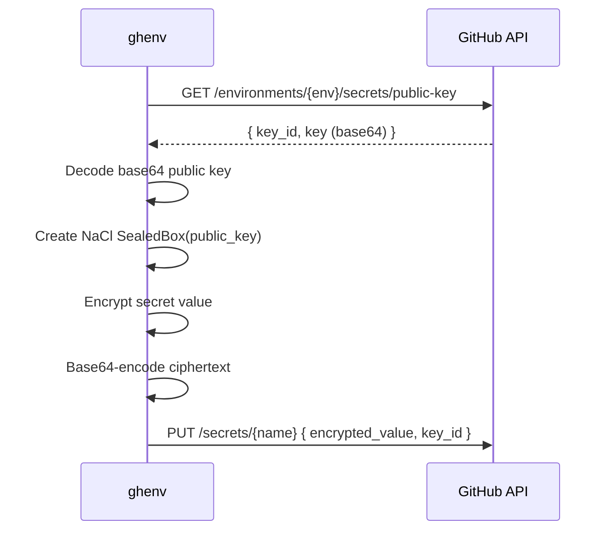

## Overview

All GitHub API communication is centralised in `ghenv_lib.py`. The module provides typed functions for each API operation, consistent error handling, and automatic pagination for list endpoints.

## API Configuration

- Base URL: `https://api.github.com`
- API version: `2022-11-28` (set via `X-GitHub-Api-Version` header)
- Authentication: Bearer token from `GH_API_SECRET` environment variable
- Required permission: `actions:write`

## Endpoints

| Function | Method | Endpoint | Success Codes | Error Behaviour |
|---|---|---|---|---|
| `get_environment_variables` | GET | `/repos/{owner}/{repo}/environments/{env}/variables` | 200 | sys.exit(1) |
| `get_environment_secrets` | GET | `/repos/{owner}/{repo}/environments/{env}/secrets` | 200 | sys.exit(1) |
| `check_variable_exists` | GET | `/repos/{owner}/{repo}/environments/{env}/variables/{name}` | 200 = True, else False | Returns bool |
| `check_secret_exists` | GET | `/repos/{owner}/{repo}/environments/{env}/secrets/{name}` | 200 = True, else False | Returns bool |
| `put_variable` | POST | `/repos/{owner}/{repo}/environments/{env}/variables` | 200, 201 | 409 = warning + skip; else sys.exit(1) |
| `put_secret` | PUT | `/repos/{owner}/{repo}/environments/{env}/secrets/{name}` | 200, 201 | 409 = warning + skip; else sys.exit(1) |
| `update_variable` | PATCH | `/repos/{owner}/{repo}/environments/{env}/variables/{name}` | 204 | sys.exit(1) |
| `update_secret` | PUT | `/repos/{owner}/{repo}/environments/{env}/secrets/{name}` | 201, 204 | sys.exit(1) |
| `delete_variable` | DELETE | `/repos/{owner}/{repo}/environments/{env}/variables/{name}` | 204 | 404 = warning + skip; else sys.exit(1) |
| `delete_secret` | DELETE | `/repos/{owner}/{repo}/environments/{env}/secrets/{name}` | 204 | 404 = warning + skip; else sys.exit(1) |
| `fetch_public_key` | GET | `/repos/{owner}/{repo}/environments/{env}/secrets/public-key` | 200 | sys.exit(1) |

## Request Pattern

Every API function follows the same structure:

1. Construct URL from owner, repo, env_name, and optional resource name
2. Build headers dict with Accept, Authorization (Bearer), and X-GitHub-Api-Version
3. Make HTTP request via `requests` library
4. Check status code against expected success codes
5. On failure: log error with status code and response text, then `sys.exit(1)`

## Pagination

`get_environment_variables` and `get_environment_secrets` use page-based pagination:

- Query parameters: `per_page=100&page={n}`
- Loop increments page number starting from 1
- Terminates when the response returns an empty list for the resource key (`variables` or `secrets`)
- All names are accumulated into a single flat list

## Secret Encryption

- Uses PyNaCl `public.SealedBox` for anonymous (sealed-box) encryption
- The public key is fetched once per create/update session and reused for all secrets
- `encrypt_secret(public_key_base64, secret_value)` returns base64-encoded ciphertext

## Error Handling

- All API errors are logged with the full URL, status code, and response body before calling `sys.exit(1)`
- 409 (Conflict) on create operations is treated as a non-fatal warning (item already exists)
- 404 on delete operations is treated as a non-fatal warning (item already gone)
- `check_variable_exists` and `check_secret_exists` return booleans and never exit

## Design Decisions

- **No retry logic**: Failed API calls exit immediately. Retries are left to the calling CI/CD pipeline or user.
- **Centralised headers**: Each function builds its own headers dict rather than sharing a session. This avoids hidden state but repeats boilerplate.
- **PUT for secrets, POST for variables**: GitHub's API uses PUT (upsert) for secrets and POST (create-only) for variables. The code mirrors this distinction.
- **Placeholder value "NONE"**: Created variables and secrets use the literal string "NONE" as a placeholder, signalling that real values must be set manually.
